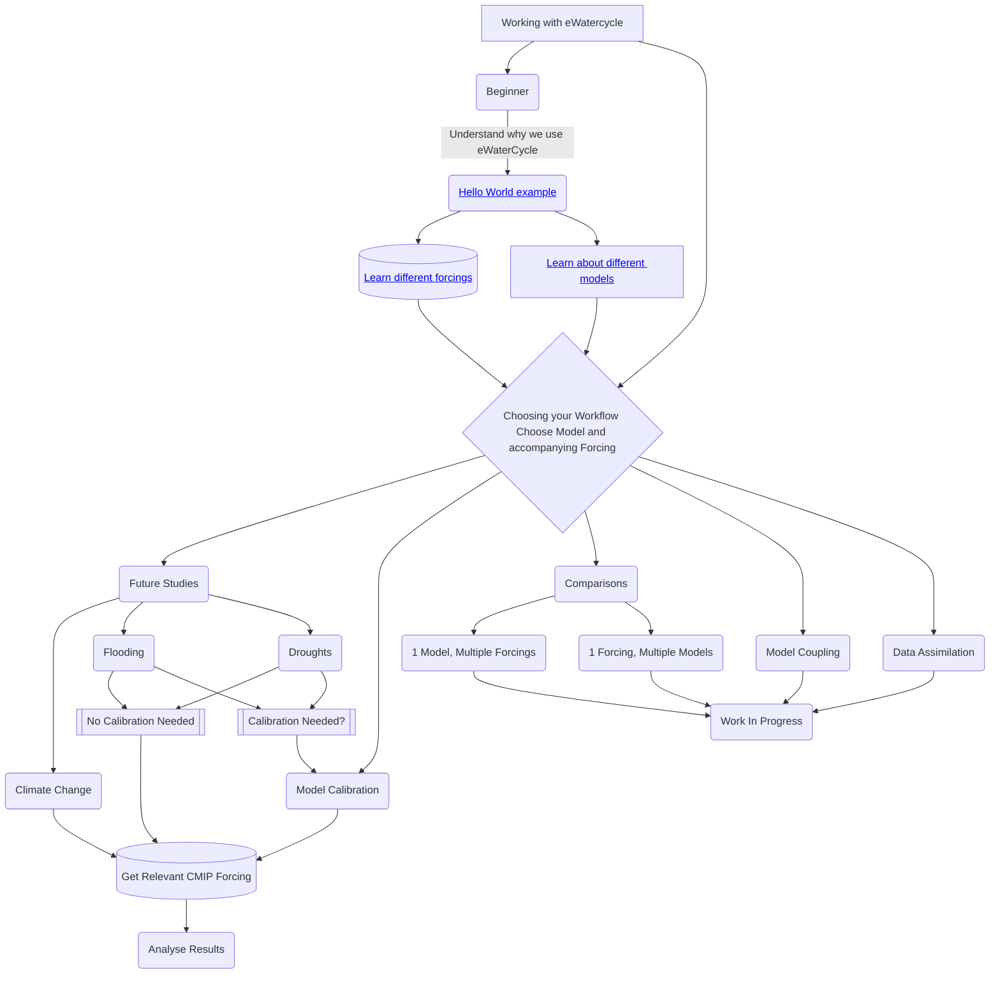

# Workflow Chart

```mermaid
graph TB
    A[Working with eWatercycle] --> B(Beginner)
    A --> F{Choosing your Workflow \nChoose Model and accompanying Forcing}
    
    B --> |Understand why we use eWaterCycle|C(<a href='https://www.ewatercycle.org/getting-started/main/some_content/first_model_run.html'>Hello World example</a>)
    
 
    C --> D[(<a href='https://www.ewatercycle.org/getting-started/main/some_content/generate_forcing.html'>Learn different forcings</a>)]
    C --> E[<a href='https://www.ewatercycle.org/getting-started/main/some_content/different_models.html'>Learn about different models</a>] 

    D --> F
    E --> F

    F --> G(Future Studies)
        G --> N(Climate Change)
            N --> O
        G --> L(Flooding)
        G --> M(Droughts)
            L --> AA[[No Calibration Needed]] 
            AA --> O[(Get Relevant CMIP Forcing)]
            L --> BB[[Calibration Needed?]] 
            BB -->  H 
            M --> AA
            
            M --> BB 
            O --> P(Analyse Results)
        
        

    F --> H(Model Calibration)
    
        H --> O
    
    F --> I(Comparisons)
        I --> R(1 Model, Multiple Forcings) --> T
        I --> S(1 Forcing, Multiple Models) --> T
    
    F --> J(Model Coupling)
        J --> T(Work In Progress)
    
    F --> K(Data Assimilation)
        K --> T
        
```