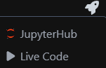
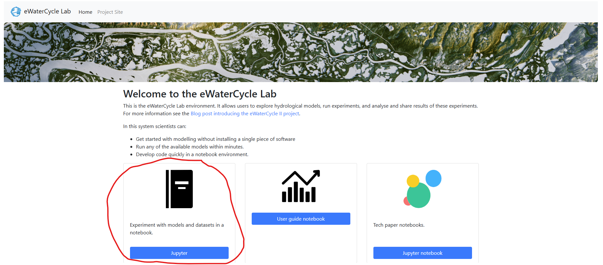

# Getting Started With eWaterCycle

##### Welcome to eWaterCycle!
A more detailed introduction can be found in the [why](https://www.ewatercycle.org/getting-started/main/some_content/why.html), [what](https://www.ewatercycle.org/getting-started/main/some_content/why/what.html) and [so what](https://www.ewatercycle.org/getting-started/main/some_content/why/sowhat.html) explaining what the platform is in more detail.
The quick version; eWaterCycle is a platform for hydrological modelling developed by hydrologists and research software engineers.
This is done to take away interoperability/compatibility issues hydrologists face, so they can perform their research more easily.
We also offer an easy way to generate the forcing data for your model, we standardized the workflow for generating forcing and host ERA5 data ourselves.

The workflow of eWaterCycle, usually, goes as follows:

$
\text{Choose region & design experiment} \rightarrow \text{get forcing} \rightarrow \text{setup model} \rightarrow \text{analyse results}
$

First, in designing your experiment you need to think about the model(s) you want use, the region or regions you want to do research in are also important.
This then leads to the 2 essential steps in eWaterCycle: getting the forcing (input) data for your region & running the model(s).
The input for different models differ, a quick example of using eWaterCycle can be found [here](https://www.ewatercycle.org/getting-started/main/some_content/first_model_run.html), and it is recommended that you start here.
It explains the default workflow quickly and from there you can make alterations to learn to work with the platform.

Once you understand the basics you can change the region ([using Caravan](https://www.ewatercycle.org/getting-started/main/some_content/forcing/era5_forcing_caravan_shapefile.html), or [your own shapefile](https://www.ewatercycle.org/getting-started/main/some_content/forcing/era5_forcing_own_shapefile.html) for example) and change the model you use.
Analyzing your results will depend on your workflow, but some examples can be found in the [workflows](https://www.ewatercycle.org/getting-started/main/some_content/workflows.html).
For advanced workflows one can also couple models.
This GitHub repository will host some basic workflows, and it will link to external, more complicated, workflows.
These workflows are meant to kickstart your journey with eWaterCycle.

More info on the different models that we support and what they need can be found [here](https://www.ewatercycle.org/getting-started/main/some_content/different_models.html).
Generating the forcing data is done shown [here](https://www.ewatercycle.org/getting-started/main/some_content/generate_forcing.html). 
This is the same for every model only the user needs to know what type of forcing and variables are needed for their chosen model(s).
After the forcing is generated the user can use different workflows, explained [here](https://www.ewatercycle.org/getting-started/main/some_content/workflows.html).

### YouTube video of eWaterCycle 1.0 (currently 2.4)
This video showcases the thought train behind eWaterCycle!

### How To Get On eWaterCycle

1. Click the *Launch eWaterCycle JupyterHub* button at the top of your screen.
It will then ask you to provide a link to your server (it defaults to a server for students).
Enter your username and password, it will then pull the *getting-started* GitHub page to your account and start at the **first run** notebook.

**OR**

2. Follow the rocket in the top right:  and click on JupyterHub. 
  (Note: this has to be inside a jupyter notebook page on teachbooks **NOTE** this cannot be used in external pages yet)
  This will take you to  where you need to click Jupyter.
  From here you need to use your login.

## Contents

A quick overview, this can be seen on the left bar of this teachbook.

- Why eWaterCycle?
  - What is eWaterCycle?
  - So Why Use eWaterCycle?
- First Model Run
  - Interface
  - Hello World: Running an HBV Model
- Different Forcing Data Generation
  - Camels Forcing using Caravan
  - ERA5 reanalysis
    - Shapefile you made yourself
    - Shapefile from Caravan dataset
  - CMIP6 historical data
  - CMIP6 future data
  - Manual data input
- Different Models
  - HBV
  - PCRGlobWB
  - Wflow
- Workflows
  - Running a Model
    - Flooding
    - Drought
    - Climate change
  - Calibrating Models
    - HBV
  - Comparisons
    - 1 model, multiple forcings
    - 1 forcing, multiple models
  - Model Coupling
  - Data Assimilation