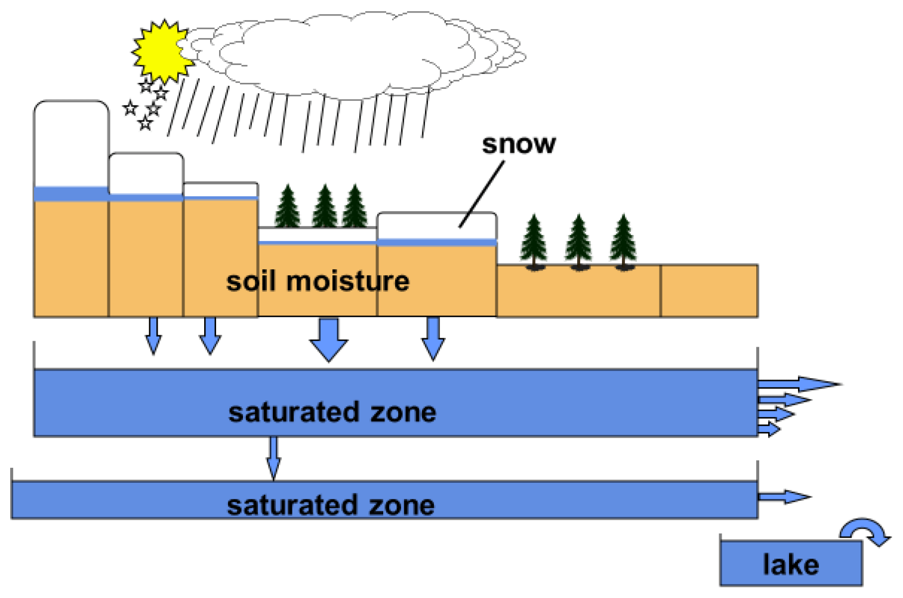
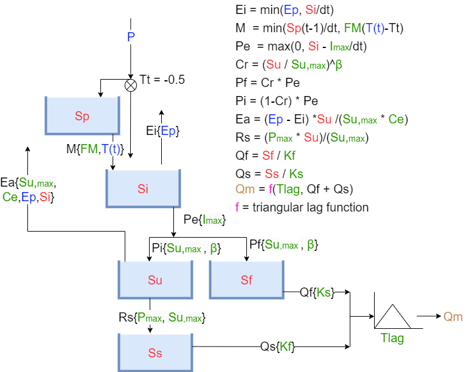
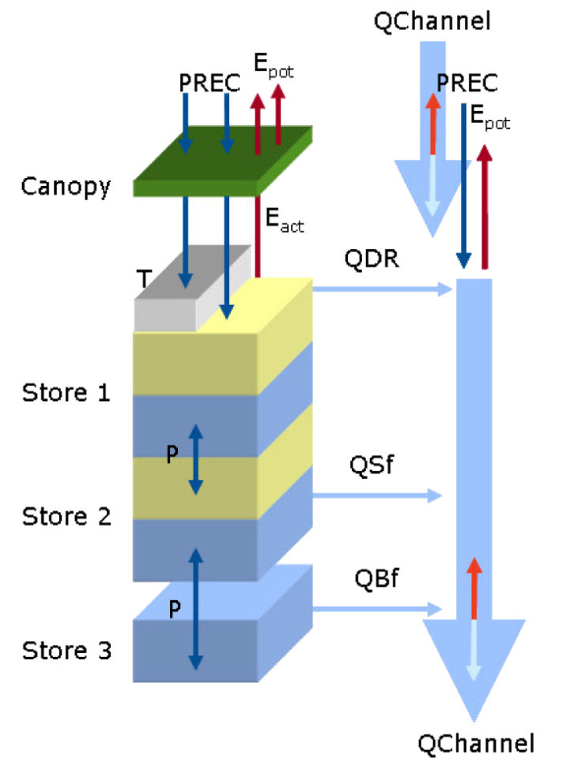

# Different Models

Here we will show you the different models that are available in eWaterCycle and what their needs and benefits are.
**NOTE** the following notebooks are from their respective GitHub pages and are not meant for this getting started guide specifically.

## HBV 

HBV (Hydrologiska Byråns Vattenbalansavdelning) is a conceptual hydrological model. For more information on its history, see this [paper](https://hess.copernicus.org/articles/26/1371/2022/).
The actual model implemented here sit looks most like the original model from [1976](https://urn.kb.se/resolve?urn=urn:nbn:se:smhi:diva-5738).

The model simplifies the entire water cycle into a few key processes and splits them up in five buckets:
- Snow
- Interception
- Soil moisture
- Slow saturation zone
- Fast saturation zone

These buckets can be seen as reservoirs that store water and release it based on the catchment characteristics.

*A retrospective on hydrological catchment modelling based on half a century with the HBV model. https://hess.copernicus.org/articles/26/1371/2022/*

The structure of the HBV model is shown below.

*Image from the TU Delft course ENVM1502 - "River Basin Hydrology" by Markus Hrachowitz.*

With the abbreviations:

<table border="0" cellpadding="10" cellspacing="0">
  <tr>
    <!-- Reservoirs Section -->
    <td valign="top">
      <table border="1" cellpadding="5" cellspacing="0">
        <thead>
          <tr>
            <th colspan="2">HBV Model Reservoirs</th>
          </tr>
          <tr>
            <th>Code</th>
            <th>Description</th>
          </tr>
        </thead>
        <tbody>
          <tr><td>Sp</td><td>Snow reservoir</td></tr>
          <tr><td>Si</td><td>Interception reservoir</td></tr>
          <tr><td>Su</td><td>Unsaturated reservoir</td></tr>
          <tr><td>Sf</td><td>Fast reservoir</td></tr>
          <tr><td>Ss</td><td>Slow reservoir</td></tr>
        </tbody>
      </table>
    </td>
    <!-- Inputs Section -->
    <td valign="top">
      <table border="1" cellpadding="5" cellspacing="0">
        <thead>
          <tr>
            <th colspan="3">HBV Model Inputs</th>
          </tr>
          <tr>
            <th>Code</th>
            <th>Description</th>
            <th>Units</th>
          </tr>
        </thead>
        <tbody>
          <tr><td>P</td><td>Precipitation</td><td>mm/day</td></tr>
          <tr><td>Ep</td><td>Potential evaporation</td><td>mm/day</td></tr>
          <tr><td>T</td><td>Temperature</td><td>°C</td></tr>
        </tbody>
      </table>
    </td>
    <!-- Parameters Section -->
    <td valign="top">
      <table border="1" cellpadding="5" cellspacing="0">
        <thead>
          <tr>
            <th colspan="3">HBV Model Parameters</th>
          </tr>
          <tr>
            <th>Code</th>
            <th>Description</th>
            <th>Units</th>
          </tr>
        </thead>
        <tbody>
          <tr><td>Imax</td><td>Interception capacity</td><td>mm</td></tr>
          <tr><td>Ce</td><td>Soil runoff coefficient</td><td>-</td></tr>
          <tr><td>Sumax</td><td>Max soil moisture storage</td><td>mm</td></tr>
          <tr><td>Beta</td><td>Shape parameter for runoff generation</td><td>-</td></tr>
          <tr><td>Pmax</td><td>Percolation threshold</td><td>mm/day</td></tr>
          <tr><td>Tlag</td><td>Routing lag time</td><td>days</td></tr>
          <tr><td>Kf</td><td>Fast runoff recession coefficient</td><td>1/day</td></tr>
          <tr><td>Ks</td><td>Slow runoff recession coefficient</td><td>1/day</td></tr>
          <tr><td>Fm</td><td>Snowmelt factor</td><td>-</td></tr>
        </tbody>
      </table>
    </td>
  </tr>
</table>

### Benefits

- easy/fast to use
- allows for ...

### Outputs

- daily discharge

### Model Needs

- Forcing:
  - Precipitation
  - Incoming solar radiation
  - Temperature
- Calibration parameters:
  - Imax: Interception capacity
  - Ce: Soil runoff coefficient
  - Sumax: Max soil moisture storage
  - Beta: Shape parameter for runoff generation
  - Pmax: Percolation threshold
  - Tlag: Routing lag time
  - Kf: Fast runoff recession coefficient
  - Ks: Slow runoff recession coefficient
  - Fm: Snowmelt factor

## PCRGlobWB 1.0

PCRGlobWB (PCRaster Global Water Balance) is a large-scale hydrological model with official [documentation](https://globalhydrology.nl/research/models/pcr-globwb-1-0/).
[eWaterCycle documentation](https://ewatercycle.readthedocs.io/en/1.3.0/examples/pcrglobwb.html).

PCR-GLOBWB is a large-scale hydrological model intended for global to regional studies and developed at the Department of Physical Geography, Utrecht University (Netherlands). 
PCR-GLOBWB provides a grid-based representation of terrestrial hydrology with a typical spatial resolution of less than 50×50 km (currently 0.5° globally) on a daily basis. 
Similar to other large-scale hydrological models, PCR-GLOBWB is essentially a leaky bucket type of model applied on a cell-by-cell basis. 
For each grid cell, PCR-GLOBWB uses process-based equations to compute moisture storage in two vertically stacked soil layers as well as the water exchange between the soil and the atmosphere and the underlying groundwater reservoir. 
Exchange to the atmosphere comprises precipitation, evapotranspiration and snow accumulation and melt, which are all modified by the presence of the canopy and snow cover. 
The exchange with the underlying groundwater reservoir comprises deep percolation and capillary rise and vertical fluxes are shown in next figure.

*Model concept of PCR-GLOBWB. Left: layers describing the soil hydrology including the canopy, snow cover, soil layers 1 & 2 and the groundwater reservoir 3 as well as the exchange of moisture between them; right: specific runoff components and the direct gains/losses over the drainage network returning discharge along the channel when routed.
Taken from https://globalhydrology.nl/research/models/pcr-globwb-1-0/*

Sub-grid variability is taken into account as follows:

* fraction of cell covered with  short and tall vegetation;
* fraction covered with freshwater, being either a river, lake or reservoir;
* fraction glaciers;
* sub-grid elevation distribution determining the accumulation and melt rate of snow and ice as well as fraction of the river plain flooded (optional);
* soil type distribution and its effect on soil hydrological properties;
* distribution of water-holding capacity of the soil resulting in variable saturation excess overland flow [Improved Arno Scheme, 2] as a result of variations in soil depth, effective porosity and elevation distribution.

### Benefits

- more detailed results

### Outputs

PCRGlobWB has many different outputs:

| Variables                                   | Variables                                       | Variables                                         | Variables                                     |
|---------------------------------------------|-------------------------------------------------|---------------------------------------------------|-----------------------------------------------|
| accumulated_land_surface_baseflow           | accumulated_land_surface_runoff                 | accumulated_total_surface_runoff                  | bare_soil_evaporation                         |
| baseflow                                    | bottom_elevation_of_lowermost_layer             | bottom_elevation_of_uppermost_layer               | channel_storage                               |
| consumptive_water_use_for_irrigation_demand | consumptive_water_use_for_non_irrigation_demand | desalination_source_abstraction                   | desalination_source_abstraction_volume        |
| direct_runoff                               | discharge                                       | domesticWaterConsumptionVolume                    | domesticWaterWithdrawalVolume                 |
| evaporation_from_irrigation                 | evaporation_from_irrigation_volume              | flood_innundation_depth                           | flood_innundation_volume                      |
| fossil_groundwater_abstraction              | fossil_groundwater_storage                      | fraction_of_desalinated_water_allocation          | fraction_of_non_fossil_groundwater_allocation |
| fraction_of_other_water_source_allocation   | fraction_of_surface_water                       | fraction_of_surface_water_allocation              | groundwater_capillary_rise                    |
| groundwater_depth_for_layer_1               | groundwater_depth_for_layer_2                   | groundwater_depth_for_top_layer                   | groundwater_head_for_layer_1                  |
| groundwater_head_for_layer_2                | groundwater_head_for_top_layer                  | groundwater_recharge                              | groundwater_storage                           |
| groundwater_thickness_estimate              | groundwater_volume_estimate                     | industryWaterConsumptionVolume                    | industryWaterWithdrawalVolume                 |
| industry_water_withdrawal                   | infiltration                                    | interception_evaporation                          | interception_storage                          |
| interflow                                   | irrigationWaterWithdrawalVolume                 | irrigation_gross_demand                           | irrigation_gross_demand_volume                |
| irrigation_withdrawal                       | lake_and_reservoir_storage                      | land_surface_actual_evaporation                   | land_surface_evaporation                      |
| land_surface_evaporation_fraction           | land_surface_potential_evaporation              | land_surface_runoff                               | land_surface_water_balance                    |
| livestockWaterConsumptionVolume             | livestockWaterWithdrawalVolume                  | livestock_water_withdrawal                        | local_water_body_flux                         |
| lower_soil_saturation_degree                | lower_soil_storage                              | lower_soil_transpiration                          | netLqWaterToSoil_at_irrigation                |
| netLqWaterToSoil_at_irrigation_volume       | net_liquid_water_to_soil                        | non_fossil_groundwater_abstraction                | non_irrigation_gross_demand                   |
| non_irrigation_gross_demand_volume          | non_paddy_irrigation_withdrawal                 | paddy_irrigation_withdrawal                       | precipitation                                 |
| precipitation_at_irrigation                 | precipitation_at_irrigation_volume              | reference_potential_evaporation                   | relativeGroundwaterHead                       |
| return_flow_from_groundwater_abstraction    | return_flow_from_irrigation_demand_withdrawal   | return_flow_from_non_irrigation_demand_withdrawal | snow_free_water                               |
| snow_free_water_evaporation                 | snow_melt                                       | snow_water_equivalent                             | surface_water_abstraction                     |
| surface_water_abstraction_volume            | surface_water_level                             | surface_water_storage                             | temperature                                   |
| top_elevation_of_uppermost_layer            | top_water_layer                                 | top_water_layer_evaporation                       | totalPotentialMaximumGrossDemand              |
| total_abstraction                           | total_evaporation                               | total_evaporation_fraction                        | total_fraction_water_allocation               |
| total_gross_demand                          | total_gross_demand_volume                       | total_groundwater_abstraction                     | total_groundwater_abstraction_volume          |
| total_groundwater_storage                   | total_thickness_of_active_water_storage         | total_thickness_of_water_storage                  | total_transpiration                           |
| total_volume_of_water_storage               | total_runoff                                    | transpiration_from_irrigation                     | transpiration_from_irrigation_volume          |
| upper_soil_saturation_degree                | upper_soil_storage                              | upper_soil_transpiration                          | water_body_actual_evaporation                 |
| water_body_evaporation_fraction             | water_body_potential_evaporation                |                                                   |                                               |

### Model Needs

* Forcing
  * Precipitation
  * Temperature
* [Parameter set](https://ewatercycle.readthedocs.io/en/latest/system_setup.html#prepare-other-parameter-sets)
  * cloneMap
  * landmask
    * there are some presets available on /data/parameter-sets/pcrglobwb_global

A [GitHub page](https://github.com/UU-Hydro/PCR-GLOBWB_input_example) on the inputs for PCRGlobWB 2.0.

## Wflow

Let us start with the documentation of Wflow, which is available [here](https://wflow.readthedocs.io/en/latest/).
